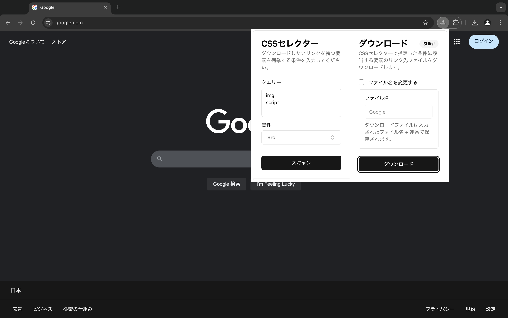
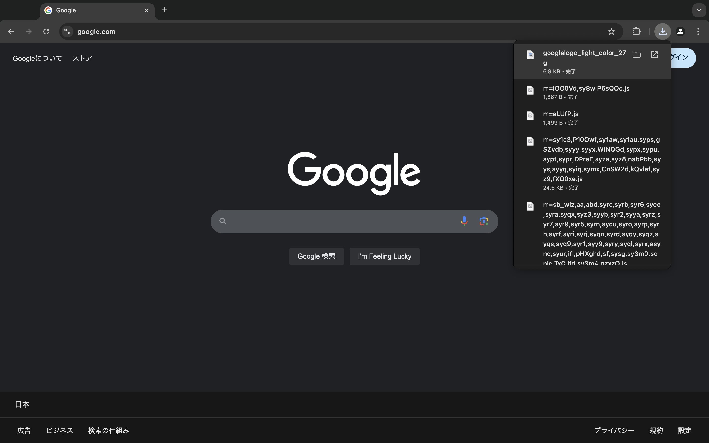
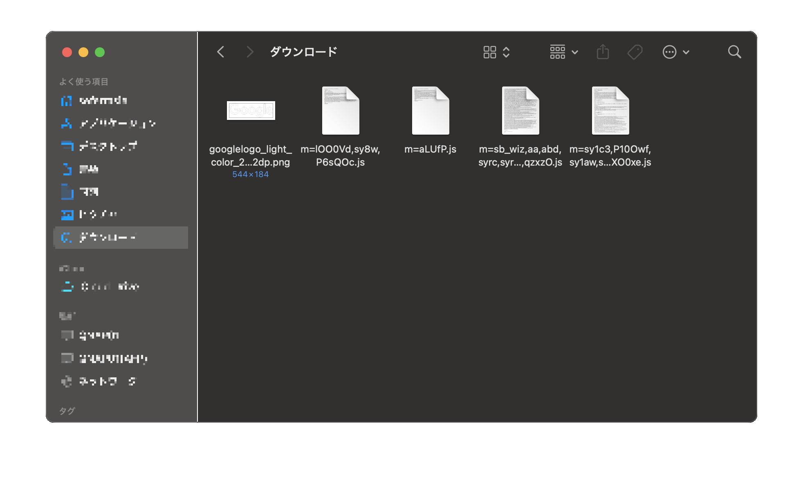

# CSS Selector Downloader

This extension allows you to specified elements with links on the displayed web page using css selector and download them all at once.

## Screenshot

## External libraries used by this extension

1. [CRXJS](https://github.com/crxjs/chrome-extension-tools)
1. [React](https://github.com/facebook/react)
1. [React Hook Form](https://github.com/react-hook-form/react-hook-form)
1. [Zod](https://github.com/colinhacks/zod)
1. [shadcn/ui](https://github.com/shadcn-ui/ui)
1. [tailwindcss](https://github.com/tailwindlabs/tailwindcss)
1. [css-selector-parser](https://github.com/mdevils/css-selector-parser)
